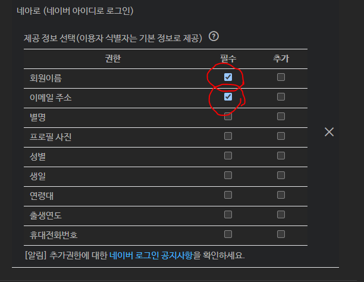

# point-shop

포인트 기반 온라인 기반상점 토이프로젝트

## 사용 기술

* Java 17 (17.0.1)
* Spring Boot 2.5.5
* Spring Data JPA
* Spring Security
* MYSQL
* MAVEN
* DOCKER

## 깃 브랜칭 전략

* forking workflow   (
  링크 : [Forking Workflow](https://gmlwjd9405.github.io/2017/10/28/how-to-collaborate-on-GitHub-2.html))

* Team repository에 대한 TMI
    * team organization의 브랜치는 ```develop```과 ```master```를 운용합니다.
    * team organization의 default branch는 ```develop``` 를 운용하고, feature 개발과 관련된 Commit은 해당 브랜치에 머지 합니다.
    * ```2021-study:point-shop/develop``` pr의 경우 merge 전에 Code Review가 강제 됩니다.
    * PR에 대해서 동료들은 Approve나 comment를 수행할 수 있습니다.
    * ```2021-study:point-shop/develop``` PR merge는 PR 본인이 직접 peer review가 끝나고 직접 Merge를 하는걸 원칙으로 합니다

## 코딩 컨벤션

* Google Coding Convention 을 참고한다 ( 링크 : [Google Coding Convention](https://google.github.io/styleguide/javaguide.html))
* **[intelliJ에 Google Coding Format 적용하기](https://github.com/2021-study/point-shop/wiki/IntelliJ-Google-Code-Style-%EC%A0%81%EC%9A%A9-%EB%B0%A9%EB%B2%95)**

## Spring Restdoc

> mvn clean -> install -> boot run
> http://localhost:8077/rest-docs/index.html

## Docker

* 도커 컨테이너 실행하기
```bash
$ cd $PROJECT_DIR/docker
$ docker-compose up -d
```

* 컨테이너 종료
  * Volumn을 초기화 하지 않으면 남은 데이터는 저장됨

```bash
$ docker-compose down
```
* 볼륨 마운트까지 제거시 ```-v``` 옵션 추가
  * 이러면 DB에 저장된 값도 날라감.

```bash
$ docker-compose down -v
```

## mysql
* 로컬에 Mysql 서버를 이용 하지 않을 분들은 docker Container를 사용해주세요
* 포트는 mysql 로컬 포트는 3306 입니다.
* 로컬에 Mysql 서버를 이미 쓰시는 분은 3306포트가 선점되어 있어서 Container가 정상적으로 뜨지 않을 수 있습니다.
  * application.yml이나 docker-compose 스크립트의 host port를 바꾸지 마시고, 둘중 하나를 사용하시는걸 권장드립니다.


## flyway

#### DataBase Migration Tool의 일종입니다.
* 공식 홈페이지 : https://flywaydb.org/
* 소개 자료 : https://ecsimsw.tistory.com/entry/Flyway%EB%A1%9C-DB-Migration

#### 주요 명령어
* ```flyway:migrate``` : 스키마와 이행 데이터를 DB에 마이그레이션
* ```flyway:clean``` : 해당 데이터베이스 모든 테이블 삭제(flyway 히스토리도 삭제) 
* ```flyway:repair``` : 마이그레이션 실패한 내역(history) 정리
* ```flyway:undo``` : 이전 버전으로 롤백
* ```flyway:validate``` : DB에 적용된 스키마와 로컬의 스키마 변경점 검증

#### migrate : 아래와 같은 커맨드를 실행하여 Migration을 진행합니다.
```bash
$ cd $PROJECT_DIR
$ ./mvnw -Dflyway.configFiles=flyway/config/local.conf flyway:migrate
```
-------

#### clean : 모든 스키마와 테이블 초기화 합니다.
* 원래는 공용 환경 DB에 이미 데이터가 쌓인 상태에서 clean을 하시면 안됩니다.
* 트러블 슈팅이 살짝 복잡할 수 있어, 어짜피 로컬로 개발을 진행하다보니 편의를 위해 Clean을 통해 초기화를 진행해도 무방할듯 합니다.

```bash
$ cd $PROJECT_DIR
$ ./mvnw -Dflyway.configFiles=flyway/config/local.conf flyway:clean
```
-------

# 프로젝트 관련 정보 
## 요구 사항
* https://docs.google.com/spreadsheets/d/1oOJCVsUSJKi5_rX3wWXLPg0Vkb6J2mU7tJAOGybK0zc/edit?usp=sharing


# SNS 로그인 연동 관련 세팅

sns.properties 를 만들어서 해당 값을 추가합니다.

[구글](https://www.google.com/search?q=spring+security+google+login+%EC%84%B8%ED%8C%85&oq=spring+security+google+login+%EC%84%B8%ED%8C%85&aqs=chrome..69i57j0i30l2j0i8i30l2&sourceid=chrome&ie=UTF-8)

[네이버](https://developers.naver.com/docs/common/openapiguide/appregister.md)

네이버의 경우 필수 항목을 이메일 & 회원이름으로 세팅



```text
# sns.properties
sns.google.client-id=구글API_client_id
sns.google.password=구글API_client_secret

sns.naver.client-id=네이버API_client_id
sns.naver.password=네이버API_client_secret
```

## Oauth2 연동 참고
* http://yoonbumtae.com/?p=3000