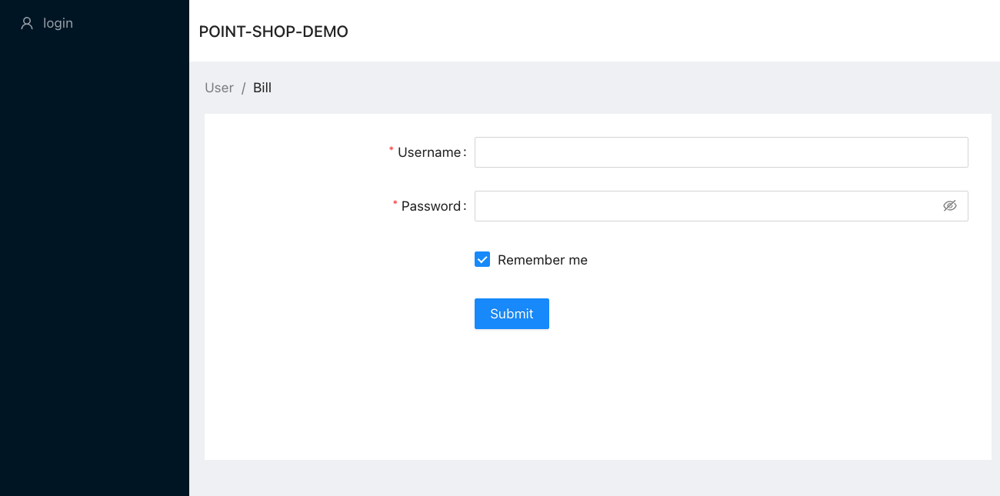

## 기획..

* 요구사항 분석 / 화면 정의 / io
https://docs.google.com/spreadsheets/d/1AzO3Xf0uZpcLlBAcasfWAu_EHWYfU9SUQK6QLDEBnPU/edit?usp=sharing

* 화면 정의
  * FE에 힘을 너무 빼지 말자...
  * 현재는 간단하게 로그인 폼만 띄워주고 있음....
  * 
    * 향후 List 뷰 / form 정도만 띄워 주는 구조.. 서버랑 REST로 정보만 주고받아 뷰만 그럭저럭 보이게 하는 수준까지만..